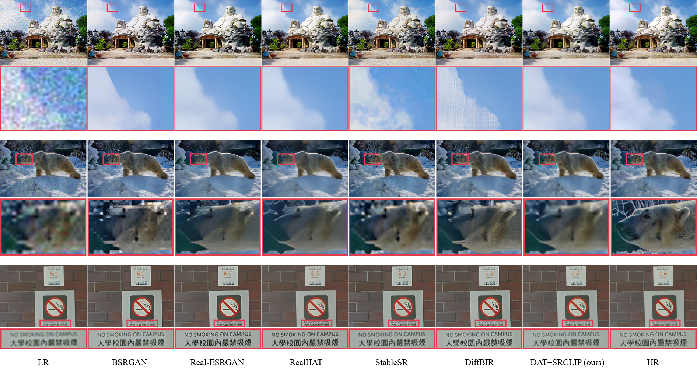

# SRCLIP: Learning degradation prior for real-world super-resolution

---

> **Abstract:** _In the image super-resolution task within real-world scenarios (Real-SR), complex and unknown degradations often lead to ambiguous local structures, which in turn affect the quality of reconstructed images. Precise extraction of degradation information from low-resolution images helps SR model to overcome the domain gap between synthetic training and real-world data, however, it remains a significant challenge. Inspired by advances in multimodal approaches and text-prompt-based image processing, we propose SRCLIP, a method that leverages large-scale pre-trained vision-language models to learn degradation features. Specifically, we introduce a degradation encoder to predict degradation features from LR images and guide the pre-trained CLIP image encoder to output clear content representations. To train SRCLIP, we design a degradation pipeline and construct a mixed degradation dataset containing LR images with corresponding captions. Additionally, we design a fusion module to enable downstream SR models to utilize prior degradation information more effectively. Our method has achieved state-of-the-art performance, with the highest improvement of 0.98 dB on PSNR. Through extensive experiments on both synthetic and real-world datasets, we demonstrate the superior ability for SRCLIP to extract real image degradation and improve super-resolution performance. Visualization results indicate that our model yields better restoration for heavily degraded LR images and showcases the capability in removing complex degradations. Our code will be publicly available soon._


## Results

We achieved state-of-the-art performance. Detailed results can be found in the paper. All visual results of our method can be downloaded [here](./results/test_RealDAT_x4_exp1/visualization). All of the results are reproducible, using the [pre-trained  models](./pretrained_models) we provide.

- Comparision with SOTA in Table 2 of the main paper.

<p align="center">
  
</p>

<details>
<summary>Click to expand</summary>


- Visual comparison (x4) in Figure 4 of the main paper.

<p align="center">
  
</p>


- Visual comparison (x4) in Figure 3 of the supplementary material.

<p align="center">
  
</p>


- Visual comparison (x4) in Figure 4 of the supplementary material.

<p align="center">
  
</p>
</details>

## How to run the code?

> We will introduce more details about how to run the code after our paper is accepted.

### Datasets

Download training and test datasets and put them into the corresponding folders of `datasets/`. Datasets can be downloaded as follows:

-  Training SRCLIP

Use `scripts/generate_lq.py` to generate LSDIR-DE using our proposed degradation pipeline.
| Training Set                                                 |                         Test Set                          | 
| :----------------------------------------------------------- | :----------------------------------------------------------: |
| LSDIR-DE|  LSDIR-DE|
- Training DAT+SRCLIP

| Training Set                                                 |                         Test Set                          | 
| :----------------------------------------------------------- | :----------------------------------------------------------: |
| [LSDIR](https://data.vision.ee.ethz.ch/yawli/index.html)|  [DIV2K](https://data.vision.ee.ethz.ch/cvl/DIV2K/)  + LSDIR + [RealSR](https://drive.google.com/file/d/17ZMjo-zwFouxnm_aFM6CUHBwgRrLZqIM/view)|


### Training

#### SRCLIP

```shell
python main.py
```

#### DAT+SRCLIP

- Run the following scripts. The training configuration is in `options/train/`.

```shell
python basicsr/train.py
```


### Test

- Evaluate the accuracies of SRCLIP in degradation classification.

```shell
python evaluate.py
```

- Test super-resolution model with SRCLIP and calculate the metrics.

```shell
python basicsr/test.py
python scripts/iqa.py
```


## Acknowledgements

This code is built on [BasicSR](https://github.com/XPixelGroup/BasicSR), [open_clip](https://github.com/mlfoundations/open_clip) and [DAT]([zhengchen1999/DAT: PyTorch code for our ICCV 2023 paper "Dual Aggregation Transformer for Image Super-Resolution"](https://github.com/zhengchen1999/DAT)). [IQA-PyTorch](https://github.com/chaofengc/IQA-PyTorch) is used to calculate metrics. Thanks for their excellent work.
